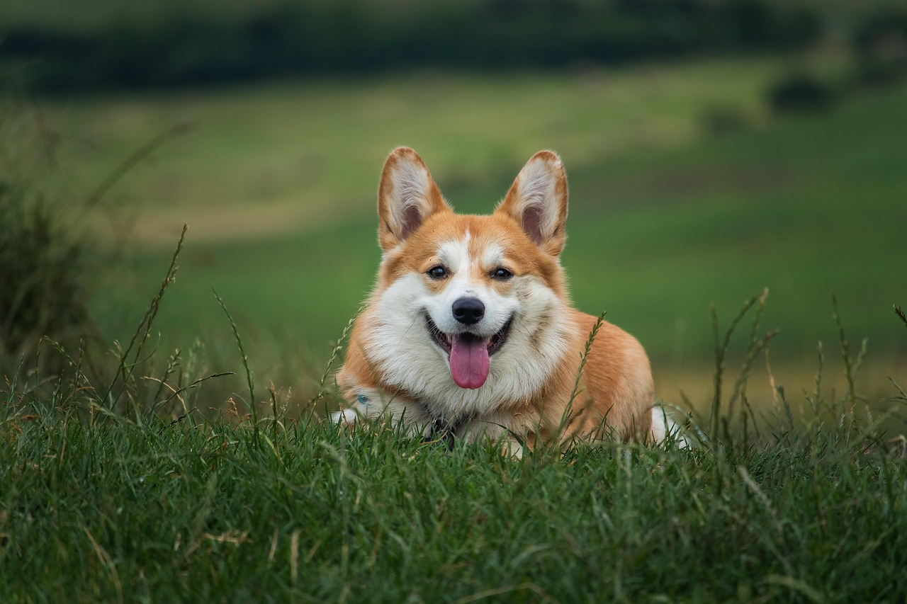

# Image Captioning với Transformer (Flickr8k)

Dự án này xây dựng hệ thống **Image Captioning** – tự động sinh mô tả ngôn ngữ tự nhiên cho hình ảnh – dựa trên kiến trúc **Encoder–Decoder với Transformer**. Mô hình được huấn luyện và đánh giá trên bộ dữ liệu chuẩn **Flickr8k**.

---

## Demo Kết quả (Ví dụ mẫu)

Dưới đây là một ví dụ thực tế về đầu ra được tự động sinh bởi mô hình sau quá trình huấn luyện:


> **Mô tả tự động sinh ra (Caption):** "a small brown and white dog is playing in the grass"

---

## Tính năng nổi bật

* **Kiến trúc hiện đại:** Kết hợp sức mạnh của CNN (Trích xuất đặc trưng) và Transformer (Xử lý ngôn ngữ).
* **Giải thuật tối ưu:** Sử dụng **Beam Search** để tăng độ chính xác và tính tự nhiên cho câu mô tả.
* **Giao diện thân thiện:** Tích hợp Web App bằng **Streamlit** hoặc Desktop GUI bằng **Tkinter** cho phép upload ảnh và xem kết quả trực quan.
* **Dễ dàng mở rộng:** Cấu trúc code modular, dễ dàng thay đổi bộ Encoder hoặc Dataset khác.

---

## Hướng dẫn sử dụng

### 1. Chạy Web App (Khuyên dùng)

Dự án có triển khai giao diện Web hiện đại bằng thư viện **Streamlit**. Để khởi động server, bạn hãy chạy lệnh:

```bash
python -m streamlit run app.py
```

> Sau khi chạy, hãy mở trình duyệt và truy cập vào địa chỉ **http://localhost:8501** để trải nghiệm giao diện tải ảnh và sinh tự động siêu mượt.

### 2. Chạy kiểm thử qua dòng lệnh (CLI Demo)

Bạn có thể sinh mô tả cho một ảnh cục bộ nhanh chóng qua Command Line bằng cách gọi script `test_inference.py`.

```bash
python test_inference.py <đường_dẫn_tới_ảnh_của_bạn>
```

**Ví dụ chạy thông qua Terminal:**
```bash
python test_inference.py sample/img.png

# ==================================================
# RESULT FOR: sample/img.png
# CAPTION: a small brown and white dog is playing in the grass
# ==================================================
```

### 3. Chạy ứng dụng Desktop GUI (Tkinter)

Nếu bạn muốn chạy bản đồ hoạ máy tính gốc bằng Tkinter:

```bash
python captiong_app.py
```

* **Bước 1:** Nhấn nút **Upload Image**.
* **Bước 2:** Chờ mô hình xử lý bằng thuật toán **Beam Search**.
* **Bước 3:** Kết quả mô tả sẽ hiển thị ở hộp thoại bên dưới.

---

## Cấu trúc thư mục

```text
.
├── models/             # Định nghĩa kiến trúc Encoder, Decoder, CaptionModel
├── datasets/           # Xử lý Flickr8kDataset và Data Transforms
├── train/              # Script huấn luyện và vòng lặp Training (Trainer)
├── utils/              # Xử lý Vocabulary, Tokenization, Preprocessing
├── saved/model/        # Lưu trữ trọng số mô hình đã huấn luyện (.pth)
├── sample/             # Hình ảnh mẫu để chạy thử nghiệm
├── captiong_app.py     # Ứng dụng giao diện người dùng (Tkinter)
├── app.py              # Ứng dụng giao diện Web mở rộng (Streamlit)
├── test_inference.py   # Script kiểm thử qua dòng lệnh (CLI)
├── requirements.txt    # Danh sách thư viện cần thiết
├── README.md           # Hướng dẫn dự án
└── config.py           # Các tham số cấu hình (Hyperparameters)
```

---

## Hướng dẫn cài đặt

### 1. Khởi tạo môi trường ảo

```bash
# Tạo môi trường ảo
python -m venv venv

# Kích hoạt (Windows)
venv\Scripts\activate

# Kích hoạt (Linux / macOS)
source venv/bin/activate
```

### 2. Cài đặt thư viện

```bash
pip install -r requirements.txt
```

> **Lưu ý:** Nếu bạn sử dụng GPU, hãy cài đặt phiên bản PyTorch phù hợp tại pytorch.org.

### 3. Tải bộ dữ liệu Flickr8k

Bạn có thể tải nhanh thông qua Kaggle API:

```bash
pip install kaggle
kaggle datasets download -d adityajn105/flickr8k
unzip flickr8k.zip -d data/flickr8k
```

Cấu trúc dữ liệu yêu cầu:

```text
data/
├── Images/       # Chứa 8,000 ảnh
└── captions.txt  # File chứa caption tương ứng
```

### 4. Chuẩn bị tài nguyên NLP

Tải bộ tokenizer cần thiết cho NLTK:

```bash
python -m nltk.downloader punkt
```

---

## Kiến trúc mô hình

Mô hình hoạt động theo quy trình khép kín:

1. **Encoder:** Sử dụng một mạng CNN (như ResNet hoặc EfficientNet) để trích xuất các vector đặc trưng (feature vector) từ ảnh đầu vào.
2. **Decoder (Transformer):** Nhận vector đặc trưng làm đầu vào "memory" và sử dụng cơ chế **Self-Attention** để dự đoán từng từ trong chuỗi mô tả.

| Thành phần | Công nghệ sử dụng |
| --- | --- |
| **Framework** | PyTorch |
| **Vision** | Torchvision (Pretrained CNN) |
| **NLP** | Transformer Decoder + NLTK |
| **Decoding Strategy** | Beam Search (K=3, 5) |
| **Loss Function** | Cross Entropy Loss |

---

## Đánh giá & Kết quả

* **Greedy Search:** Sinh từ nhanh nhưng đôi khi bị lặp hoặc cụt ngủn.
* **Beam Search:** Duy trì nhiều ứng viên câu cùng lúc (K câu tốt nhất), giúp câu văn mượt mà và giàu ngữ nghĩa hơn.
* **Loss:** Mô hình được tối ưu hóa bằng Cross Entropy, giúp hội tụ nhanh sau khoảng 10-20 epochs trên Flickr8k.
